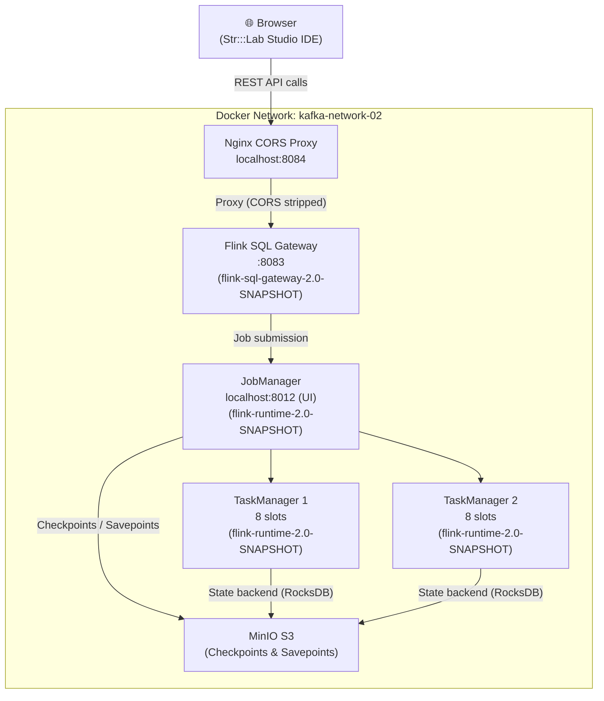

# Flink 2.0 Dev Cluster — Str:::Lab Studio + Str:::Beam Engine

> ⚠️ **Version Notice:** This cluster runs **Apache Flink 2.0** patched with the **Str:::Beam Engine** multi-tenancy runtime (`flink-runtime-2.0-SNAPSHOT`). The patched runtime must be present in all cluster nodes (JobManager, TaskManager, SQL Gateway). A separate Flink 1.19 cluster exists for legacy Java 11 UDFs. See [Switching Flink Versions](#switching-flink-versions) if you need the older version.

---

## Overview

This is a personal **development and testing** setup for the **Str:::Lab Studio** platform — a browser-based Flink SQL IDE that connects to a local Flink cluster via SQL Gateway. The stack includes a JobManager, two TaskManagers, a Flink SQL Gateway, and an Nginx CORS proxy — all wired together over a shared Docker network.

The cluster runs a **patched Flink 2.0 runtime** built for the **Str:::Beam Engine**, which adds multi-tenancy support at the runtime level. All nodes must run the same patched snapshot JAR (`flink-runtime-2.0-SNAPSHOT.jar`) — mixing the official `2.0.0` release with the snapshot build will cause TaskManagers to fail registration.

---

## What Changed in the Flink 2.0 Upgrade

### Breaking Changes from Flink 1.19

**Configuration format** — Flink 2.0 replaced `flink-conf.yaml` with `config.yaml` using a nested YAML structure. The old flat key-value format is no longer picked up by the runtime. Volume mounts must point to `config.yaml`:

```yaml
# Old (Flink 1.19) — no longer works
- ./conf/flink-conf.yaml:/opt/flink/conf/flink-conf.yaml:ro

# New (Flink 2.0)
- ./conf/config.yaml:/opt/flink/conf/config.yaml:ro
```

The config file itself now uses nested keys:

```yaml
# Old flat format
jobmanager.rpc.address: codedstream-jobmanager

# New nested format
jobmanager:
  rpc:
    address: codedstream-jobmanager
```

**`FLINK_PROPERTIES` env var** — This environment variable no longer overrides the built-in `config.yaml` in Flink 2.0. All cluster configuration must go through the mounted `config.yaml` file. The `FLINK_PROPERTIES` blocks have been removed from `docker-compose.yaml` and replaced with the config file mount.

**Java version** — Flink 2.0 requires Java 17. UDFs written for Java 11 (used with the 1.19 cluster) are not compatible and must be recompiled targeting Java 17.

**Connector versions** — All connectors have been updated to versions compatible with Flink 2.0 (e.g., `flink-connector-mysql-cdc-3.1.1`, `flink-connector-postgres-cdc-3.1.1`).

### Str:::Beam Engine Patch

The cluster runs a patched runtime JAR (`flink-runtime-2.0-SNAPSHOT.jar`, built 2026-05-23) that adds multi-tenancy support to the Flink 2.0 execution layer. This patch is part of the ongoing **Str:::Beam Engine** project and is currently in active testing.

**Important:** All cluster nodes must run the same patched runtime. The patched JAR must be present in `/opt/flink/lib/` on every node. If you rebuild the image or `docker cp` the JAR manually, make sure it reaches all containers:

```powershell
docker cp flink-runtime-2.0-SNAPSHOT.jar codedstream-jobmanager:/opt/flink/lib/
docker cp flink-runtime-2.0-SNAPSHOT.jar codedstream-taskmanager:/opt/flink/lib/
docker cp flink-runtime-2.0-SNAPSHOT.jar codedstream-taskmanager-2:/opt/flink/lib/
docker cp flink-sql-gateway-2.0-SNAPSHOT.jar flink-sql-gateway:/opt/flink/lib/
```

A version mismatch between the JobManager (official `2.0.0`) and TaskManagers (snapshot) will cause TaskManagers to silently fail registration after 5 minutes with a `RegistrationTimeoutException`, even though the cluster appears healthy from the JobManager side.

---

## Architecture



---

## Project Structure

```
FLINK-CLUSTER/
├── conf/
│   └── config.yaml                  # Flink 2.0 cluster configuration (nested YAML format)
├── config/                          # Additional config files
├── connectors/                      # Connector JARs (populated by download script)
├── nginx/
│   ├── flink-cors.conf              # CORS proxy config for SQL Gateway
│   └── studio.conf                  # Nginx config for Studio IDE (optional)
├── plugins/
│   └── s3-fs-hadoop/                # S3/MinIO filesystem plugin
├── sql-scripts/                     # Your saved SQL scripts
├── docker-compose.yaml              # Main compose file
├── Dockerfile.flink                 # Custom Flink 2.0 image with patched runtime
├── flink-runtime-2.0-SNAPSHOT.jar   # Str:::Beam Engine patched runtime (all nodes)
├── flink-sql-gateway-2.0-SNAPSHOT.jar # Patched SQL Gateway runtime
├── download-connectors.ps1          # Downloads all connector JARs (PowerShell)
├── download-connectors-simple.ps1   # Simplified version
├── entrypoint-with-plugins.sh       # Container entrypoint script
├── setup.bat                        # Windows setup script
├── setup.ps1                        # PowerShell setup script
├── sql-client-config.yaml           # Flink SQL Client configuration
└── sql-gateway-defaults.yaml        # Flink SQL Gateway defaults
```

---

## Prerequisites

- [Docker Desktop](https://www.docker.com/products/docker-desktop/) (Windows/macOS) or Docker + Docker Compose (Linux)
- PowerShell 5+ (Windows) — for running setup and connector download scripts
- Java 17 for any UDFs you compile against this cluster
- MinIO running on the `kafka-network-02` network (for checkpoints) — or disable checkpointing in `config.yaml`
- The Str:::Beam Engine patched JARs (`flink-runtime-2.0-SNAPSHOT.jar`, `flink-sql-gateway-2.0-SNAPSHOT.jar`)

---

## Quick Start

### Step 1 — Run the Setup Script

**Windows (PowerShell):**
```powershell
.\setup.ps1
```

**Windows (Command Prompt):**
```bat
setup.bat
```

This will:
- Create all required directories
- Validate that required config files exist
- Create the `kafka-network-02` Docker network if it doesn't exist

---

### Step 2 — Download Connectors

The Flink image bakes connectors into `/opt/flink/lib` at build time. You must populate the `connectors/` folder **before** building the image.

**Option A — PowerShell (Windows):**
```powershell
.\download-connectors.ps1
```

**Option B — Bash (Linux/macOS):**

```bash
#!/bin/bash
CONNECTORS_DIR="./connectors"
mkdir -p "$CONNECTORS_DIR"

BASE_URL="https://repo1.maven.apache.org/maven2"

download() {
  local url="$1"
  local dest="$2"
  echo "Downloading $dest..."
  curl -L --fail -o "$CONNECTORS_DIR/$dest" "$url" && echo "OK" || echo "FAILED: $url"
}

# Example — replicate the full list from download-connectors.ps1
download "$BASE_URL/org/apache/flink/flink-connector-mysql-cdc/3.1.1/flink-connector-mysql-cdc-3.1.1.jar" \
         "flink-connector-mysql-cdc-3.1.1.jar"
```

> The full connector list is defined in `download-connectors.ps1`. Make sure connector versions are compatible with Flink 2.0.

**Connectors included:**

| Category | Connector |
|---|---|
| Messaging | Kafka, Pulsar, AWS Kinesis |
| Database | JDBC (PostgreSQL/MySQL), MongoDB |
| CDC | MySQL CDC 3.1.1, PostgreSQL CDC 3.1.1 |
| Storage | S3/MinIO (Hadoop FS) |
| Search | Elasticsearch 7 |
| Lakehouse | Apache Hive, Apache Iceberg |
| Formats | Avro, Avro + Confluent Schema Registry, JSON, CSV, Parquet, ORC |
| Drivers | PostgreSQL 42.7.3, MySQL Connector/J 8.3.0 |

---

### Step 3 — Build and Start the Cluster

```bash
docker compose up -d --build
```

> The `--build` flag is required on first run or after adding/changing connectors or the patched runtime JAR.

To rebuild from scratch:
```bash
docker compose down
docker compose build --no-cache
docker compose up -d
```

---

### Step 4 — Verify the Cluster

Check all services are healthy:
```bash
docker compose ps
```

Confirm all nodes are running the patched runtime (look for `2.0-SNAPSHOT` in the version line):
```bash
docker logs codedstream-jobmanager 2>&1 | grep "Starting StandaloneSession"
docker logs codedstream-taskmanager 2>&1 | grep "Starting TaskManager"
```

Both should show `Version: 2.0-SNAPSHOT, Rev:793b76d`. If the JobManager shows `Version: 2.0.0` and the TaskManager shows `2.0-SNAPSHOT`, the patched JAR was not baked into the image — see [Troubleshooting](#troubleshooting).

---

## Service URLs

| Service | URL | Notes |
|---|---|---|
| Flink Web UI | http://localhost:8012 | JobManager dashboard |
| CORS Proxy | http://localhost:8084 | Use this in the Str:::Lab Studio IDE |
| Flink SQL Gateway | http://localhost:8083 | Direct (no CORS headers) |

**Str:::Lab Studio IDE connection settings:**
```
Host: localhost
Port: 8084
```

---

## Configuration

### `conf/config.yaml`

Flink 2.0 uses nested YAML. Key settings you may want to adjust:

```yaml
jobmanager:
  rpc:
    address: codedstream-jobmanager
    port: 6123
  bind-host: 0.0.0.0
  memory:
    process:
      size: 1600m

taskmanager:
  bind-host: 0.0.0.0
  numberOfTaskSlots: 10
  memory:
    process:
      size: 1728m
    managed:
      fraction: 0.4

parallelism:
  default: 1

rest:
  address: 0.0.0.0
  port: 8081

state:
  backend: rocksdb
  backend:
    incremental: true
  checkpoints:
    dir: s3://flink-checkpoints/checkpoints
  savepoints:
    dir: s3://flink-checkpoints/savepoints

execution:
  checkpointing:
    interval: 10s
    mode: EXACTLY_ONCE
```

| Setting | Default | Description |
|---|---|---|
| `taskmanager.numberOfTaskSlots` | `10` | Slots per TaskManager (×2 TMs = 20 total) |
| `parallelism.default` | `1` | Default job parallelism |
| `taskmanager.memory.process.size` | `1728m` | Memory per TaskManager |
| `jobmanager.memory.process.size` | `1600m` | JobManager memory |
| `state.backend` | `rocksdb` | State backend |
| `execution.checkpointing.interval` | `10s` | Checkpoint frequency |
| `s3.endpoint` | `http://minio:9000` | MinIO endpoint |

### Disabling Checkpointing (no MinIO)

Comment out the checkpoint/savepoint directories in `config.yaml` and switch to a simpler backend:

```yaml
state:
  backend: hashmap
# checkpoints and savepoints dirs removed
```

---

## Switching Flink Versions

To switch back to the Flink 1.19 cluster for legacy Java 11 UDF development:

1. **`docker-compose.yaml`** — update the `image` tag for `flink-sql-gateway` and `codedstream-sql-client`:
   ```yaml
   image: flink:1.19.1-scala_2.12-java11
   ```

2. **`Dockerfile.flink`** — update the `FROM` base image:
   ```dockerfile
   FROM flink:1.19.1-scala_2.12-java11
   ```

3. **`conf/config.yaml`** — rename back to `conf/flink-conf.yaml` and restore the flat key-value format for Flink 1.19.

4. **`docker-compose.yaml`** — update the volume mount back to:
   ```yaml
   - ./conf/flink-conf.yaml:/opt/flink/conf/flink-conf.yaml:ro
   ```

5. **`download-connectors.ps1`** — downgrade connector versions to match Flink 1.19. Check [Maven Central](https://repo1.maven.org/maven2/org/apache/flink/) for compatible versions.

6. Remove the Str:::Beam Engine snapshot JARs from the Dockerfile — they are not compatible with 1.19.

7. Rebuild:
   ```bash
   docker compose down
   docker compose build --no-cache
   docker compose up -d
   ```

> **Note:** The Flink 2.0 patched cluster and the Flink 1.19 cluster cannot run simultaneously on the same ports. Stop one before starting the other.

---

## Stopping the Cluster

```bash
docker compose down
```

To also remove volumes:
```bash
docker compose down -v
```

---

## Troubleshooting

**TaskManagers not connecting / `RegistrationTimeoutException` after 5 minutes:**
- This almost always means a version mismatch between the JobManager and TaskManagers. Check that all nodes report `2.0-SNAPSHOT` and not the official `2.0.0` release.
- The patched `flink-runtime-2.0-SNAPSHOT.jar` must be in `/opt/flink/lib/` on every node. If you're copying it manually after startup, copy to all containers and restart them.
- Confirm the JobManager is binding to `codedstream-jobmanager:6123` and not `localhost:6123` by checking: `docker logs codedstream-jobmanager 2>&1 | grep "Actor system started"`

**JobManager binding to `localhost` instead of `codedstream-jobmanager`:**
- Your `config.yaml` is not being picked up. In Flink 2.0 the config file must be named `config.yaml` (not `flink-conf.yaml`) and mounted at `/opt/flink/conf/config.yaml`.
- Verify inside the container: `docker exec codedstream-jobmanager cat /opt/flink/conf/config.yaml`
- The `FLINK_PROPERTIES` environment variable does not override `config.yaml` in Flink 2.0.

**SQL Gateway not reachable from the IDE:**
- Confirm the CORS proxy is running: `docker compose ps flink-gateway-cors-proxy`
- Test directly: `curl http://localhost:8084/info`
- Check logs: `docker logs flink-gateway-cors-proxy`

**Connector class not found at runtime:**
- Rebuild the image: `docker compose build --no-cache`
- Verify the JAR is in `connectors/` before building
- Check what's in the container: `docker exec codedstream-taskmanager ls /opt/flink/lib/`

**MinIO / S3 errors on startup:**
- Ensure MinIO is running on `kafka-network-02`
- Or disable S3 checkpointing (see [Disabling Checkpointing](#disabling-checkpointing-no-minio) above)

**UDFs failing with class not found or incompatible class version:**
- UDFs compiled for Java 11 / Flink 1.19 are not compatible with this cluster. Recompile targeting Java 17 and update any API calls that changed in Flink 2.0.

---

## Notes

- This is a **personal development setup** — not hardened for production use
- The Str:::Beam Engine patch (`flink-runtime-2.0-SNAPSHOT`) is under active development and testing — expect changes
- Credentials (`minio/minio123`) are intentionally simple for local dev
- The `kafka-network-02` external network is shared with a Kafka stack running separately
- The `studio/` Nginx service is commented out in `docker-compose.yaml` — Str:::Lab Studio is served externally and connects via the CORS proxy on port `8084`