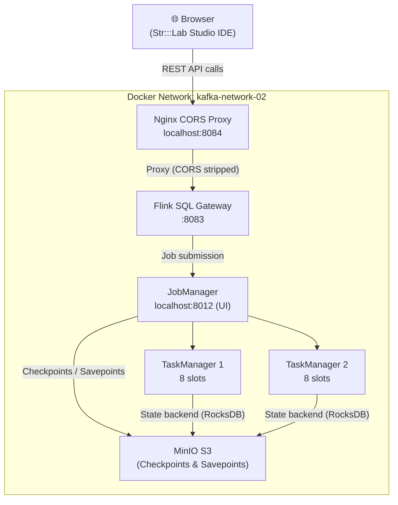

# Flink 1.19 Dev Cluster — Str:::Lab Studio

> ⚠️ **Version Notice:** This cluster runs **Apache Flink 1.19.1** — an older version intentionally chosen for development and testing of the **Str:::Lab Studio** platform. The majority of UDFs in this setup are written in **Java 11** and are tied to the Flink 1.19 API. A separate Flink 2.0 cluster exists. See [Switching Flink Versions](#switching-flink-versions) if you want to run a different version.

---

## Overview

This is a personal **development and testing** setup for the **Str:::Lab Studio** platform — a browser-based Flink SQL IDE that connects to a local Flink cluster via SQL Gateway. The stack includes a JobManager, two TaskManagers, a Flink SQL Gateway, and an Nginx CORS proxy — all wired together over a shared Docker network.

---

## Architecture



---

## Project Structure

```
FLINK-CLUSTER/
├── conf/
│   └── flink-conf.yaml              # Flink cluster configuration
├── config/                          # Additional config files
├── connectors/                      # Connector JARs (populated by download script)
├── nginx/
│   ├── flink-cors.conf              # CORS proxy config for SQL Gateway
│   └── studio.conf                  # Nginx config for Studio IDE (optional)
├── plugins/
│   └── s3-fs-hadoop/                # S3/MinIO filesystem plugin
├── sql-scripts/                     # Your saved SQL scripts
├── docker-compose.yaml              # Main compose file
├── Dockerfile.flink                 # Custom Flink image with connectors
├── download-connectors.ps1          # Downloads all connector JARs (PowerShell)
├── download-connectors-simple.ps1   # Simplified version
├── entrypoint-with-plugins.sh       # Container entrypoint script
├── setup.bat                        # Windows setup script
├── setup.ps1                        # PowerShell setup script
├── sql-client-config.yaml           # Flink SQL Client configuration
└── sql-gateway-defaults.yaml        # Flink SQL Gateway defaults
```

---

## Prerequisites

- [Docker Desktop](https://www.docker.com/products/docker-desktop/) (Windows/macOS) or Docker + Docker Compose (Linux)
- PowerShell 5+ (Windows) — for running setup and connector download scripts
- MinIO running on the `kafka-network-02` network (for checkpoints) — or disable checkpointing in `flink-conf.yaml`

---

## Quick Start

### Step 1 — Run the Setup Script

**Windows (PowerShell):**
```powershell
.\setup.ps1
```

**Windows (Command Prompt):**
```bat
setup.bat
```

This will:
- Create all required directories
- Validate that required config files exist
- Create the `kafka-network-02` Docker network if it doesn't exist

---

### Step 2 — Download Connectors

The Flink image bakes connectors into `/opt/flink/lib` at build time. You must populate the `connectors/` folder **before** building the image.

**Option A — PowerShell (Windows):**
```powershell
.\download-connectors.ps1
```

**Option B — Convert to Bash (Linux/macOS):**

The PowerShell script can be straightforwardly converted to a shell script. The connector list and Maven URLs are the same — replace `$Mirrors`, `$Connectors`, and the download loop with `curl` equivalents:

```bash
#!/bin/bash
CONNECTORS_DIR="./connectors"
mkdir -p "$CONNECTORS_DIR"

BASE_URL="https://repo1.maven.apache.org/maven2"

download() {
  local url="$1"
  local dest="$2"
  echo "Downloading $dest..."
  curl -L --fail -o "$CONNECTORS_DIR/$dest" "$url" && echo "OK" || echo "FAILED: $url"
}

# Example — replicate the full list from download-connectors.ps1
download "$BASE_URL/org/apache/flink/flink-sql-connector-kafka/3.3.0-1.19/flink-sql-connector-kafka-3.3.0-1.19.jar" \
         "flink-sql-connector-kafka-3.3.0-1.19.jar"

# ... add remaining connectors from the .ps1 file
```

> The full connector list is defined in `download-connectors.ps1`. Copy each entry's `group`, `artifact`, `version`, and `file` fields to build the download URLs.

**Connectors included:**

| Category | Connector |
|---|---|
| Messaging | Kafka, Pulsar, AWS Kinesis |
| Database | JDBC (PostgreSQL/MySQL), MongoDB |
| CDC | MySQL CDC, PostgreSQL CDC |
| Storage | S3/MinIO (Hadoop FS) |
| Search | Elasticsearch 7 |
| Lakehouse | Apache Hive, Apache Iceberg |
| Formats | Avro, Avro + Confluent Schema Registry, JSON, CSV, Parquet, ORC |
| Drivers | PostgreSQL JDBC Driver, MySQL Connector/J |

---

### Step 3 — Build and Start the Cluster

```bash
docker compose up -d --build
```

> The `--build` flag is required on first run or after adding/changing connectors.

To rebuild from scratch (e.g., after adding new connectors):
```bash
docker compose down
docker compose build --no-cache
docker compose up -d
```

---

### Step 4 — Verify the Cluster

Check all services are healthy:
```bash
docker compose ps
```

Verify connectors are loaded in the TaskManager:
```bash
docker exec codedstream-taskmanager ls /opt/flink/lib/*.jar | wc -l
```

---

## Service URLs

| Service | URL | Notes |
|---|---|---|
| Flink Web UI | http://localhost:8012 | JobManager dashboard |
| CORS Proxy | http://localhost:8084 | Use this in the Str:::Lab Studio IDE |
| Flink SQL Gateway | http://localhost:8083 | Direct (no CORS headers) |

**Str:::Lab Studio IDE connection settings:**
```
Host: localhost
Port: 8084
```

---

## Configuration

### `conf/flink-conf.yaml`

Key settings you may want to adjust:

| Setting | Default | Description |
|---|---|---|
| `taskmanager.numberOfTaskSlots` | `10` | Slots per TaskManager (×2 TMs = 20 total) |
| `parallelism.default` | `1` | Default job parallelism |
| `taskmanager.memory.process.size` | `1728m` | Memory per TaskManager |
| `jobmanager.memory.process.size` | `1600m` | JobManager memory |
| `state.backend` | `rocksdb` | State backend |
| `execution.checkpointing.interval` | `10s` | Checkpoint frequency |
| `s3.endpoint` | `http://minio:9000` | MinIO endpoint |

### Disabling Checkpointing (no MinIO)

If you don't have MinIO running, comment out the checkpoint/savepoint directories in `flink-conf.yaml`:

```yaml
# state.checkpoints.dir: s3://flink-checkpoints/checkpoints
# state.savepoints.dir: s3://flink-checkpoints/savepoints
# state.backend: rocksdb
```

And set a simpler backend:
```yaml
state.backend: hashmap
```

---

## Switching Flink Versions

This setup is designed to be version-agnostic. To switch to a different Flink version:

1. **`docker-compose.yaml`** — update the `image` tag for `flink-sql-gateway` and `codedstream-sql-client`:
   ```yaml
   image: flink:1.20.0-scala_2.12-java11   # or java17, etc.
   ```

2. **`Dockerfile.flink`** — update the `FROM` base image:
   ```dockerfile
   FROM flink:1.20.0-scala_2.12-java11
   ```

3. **`download-connectors.ps1`** — update connector versions to match the new Flink release. Check [Maven Central](https://repo1.maven.apache.org/maven2/org/apache/flink/) for compatible versions.

4. Rebuild:
   ```bash
   docker compose down
   docker compose build --no-cache
   docker compose up -d
   ```

> **Note on Flink 2.0:** Flink 2.0 introduced breaking API changes. Many connectors and UDFs written for 1.x will require migration. This cluster intentionally stays on 1.19 to maintain compatibility with existing Java 11 UDFs.

---

## Stopping the Cluster

```bash
docker compose down
```

To also remove volumes:
```bash
docker compose down -v
```

---

## Troubleshooting

**SQL Gateway not reachable from the IDE:**
- Confirm the CORS proxy is running: `docker compose ps flink-gateway-cors-proxy`
- Test directly: `curl http://localhost:8084/info`
- Check logs: `docker logs flink-gateway-cors-proxy`

**TaskManagers not connecting:**
- Wait for the JobManager healthcheck to pass before TaskManagers start (handled automatically via `depends_on`)
- Check JobManager logs: `docker logs codedstream-jobmanager`

**Connector class not found at runtime:**
- Rebuild the image: `docker compose build --no-cache`
- Verify the JAR is in `connectors/` before building
- Check what's in the container: `docker exec codedstream-taskmanager ls /opt/flink/lib/`

**MinIO / S3 errors on startup:**
- Ensure MinIO is running on `kafka-network-02`
- Or disable S3 checkpointing (see [Disabling Checkpointing](#disabling-checkpointing-no-minio) above)

---

## Notes

- This is a **personal development setup** — not hardened for production use
- Credentials (`minio/minio123`) are intentionally simple for local dev
- The `kafka-network-02` external network is shared with a Kafka stack running separately
- The `studio/` Nginx service is commented out in `docker-compose.yaml` — Str:::Lab Studio is served externally and connects via the CORS proxy on port `8084`